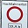
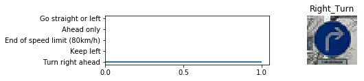

# Traffic Sign Recognition

The goal of this project is to classify 43 type's of Traffic Signs using Convolution Neural Networks.

## Steps of the Project:
* Load the dataset and divide Train, Validate and Test arrays.
* Explore the dataset and types of signs present.
* Pre-process the data to be used for the CNN.
* Model the architecture for CNN and set the hyperparameters.
* Use the model built to make predictions on new images.
* Analize the new predictions.

## Rubic Points
### Dataset Exploration:
***
**Dataset Summary:** The basic summary of the dataset was given by following the guidelines already given in the notebook.
***
**Exploratory Visualization:** Graphs were plotted showing the number of image per class. The types of classes were also shown and an example was provided for each class for better understanding and clarity.
***

### Design and Test a Model Architecture

***

**Preprocessing:** The images were rotated to &plusmn;5 degrees and CLAHE(contrast limited adaptive histogram equalization) transform was applied to the image batches before training or testing the network.

Initially Histogram Equilization was used but CLAHE gave better results.

Example for image rotation:

Original image :  Rotated image : 

Examples for CLAHE Transform:(Before/After)

***

**Model Architecture:** 

| Layer        | Description           |
| -------------|:--------------------:|
| Input        | 32x32x3 RGB |
| 5x5 Convolution, 16 layers|1x1 stride, same padding, output:32x32x16|
| Batch Normalization |  |
| ReLU | Applying Rectified Linear Unit as Activation |
| Max-Pooling | 2x2 strides, output:16x16x16 |
| 3x3 Convolution, 32 layers|1x1 stride, same padding, output:16x16x32|
| Batch Normalization |  |
| ReLU | Applying Rectified Linear Unit as Activation |
| Max-Pooling | 2x2 strides, output:8x8x32 |
| 3x3 Convolution, 64 layers|1x1 stride, same padding, output:8x8x64|
| Batch Normalization |  |
| ReLU | Applying Rectified Linear Unit as Activation |
| Max-Pooling | 2x2 strides, output:4x4x64|
| Fully Connected 1 | Flatten:1024(4x4x64), 1024 fully connected to 400 |
| Dropout | Dropout is applied with a keep_probability = 0.5 |
| Fully Connected 2 | 400 fully connected to 120 |
| Dropout | Dropout is applied with a keep_probablility = 0.5 |
| Fully Connected 3 | 120 fully connected to 84 |
| Dropout | Dropout is applied with a keep_probability = 0.5 |
| Final Layer | 84 fully connected to 43 [Output] |
***

** Model Training:**
* __Loss Function__ : Cross Entropy
* __Optimizer__ : Adam
* __Learning Rate__ : 0.0002
* __Epoch__ : 55
* __batch__ : 128
* __Keep Probability__ : 0.5

***

**Solution Approach: ** The first architecture that was chosen was LeNet-5. It was chosen because the input/output parameters could be easily modified for given dataset and was a good starting point. One problem was that LeNet-5 could not genralize well on the given dataset which resulted in not so good validation accuracy. The following adjustements were made on the LeNet-5 architecture.

Adjustements that were made:
* Another layer was added to the model for the model to detect more complex images.
* No of filters in each layers was increased for the model to detect complex shapes.
* The pooling size was decreased in the later layers as the size of the input decreases.
* Another Fully Connected Layer was added.
* Dropout was added between the Fully Connected layer's.
* Batch Normalization was applied between all the convolution layers.
* Learning Rate was reduced as it was observed that the model was underfitting.
* Keep Probability was also reduces from 0.7 to 0.5 in order for the model to not underfit.

Validation Accuracy = 97% (approx.)

Test Accuracy = 96% (approx.)

***

**Validation Accuracy:** 

### New Images used for testing the model:

**30 Km/h (1) --> ** **Yield --> **   **No Entry (1) --> ** **No Entry (2) --> ** **No Vehicles (1) -->** 

**No Vehicles (2) -->** **Priority Road --> ** **Right Turn --> ** **30 Km/h (2) --> ** 

**Straight or Right Turn -->** 

**Predictions on the new model:**

| Image | Prediction |
| ---------- | :---------: |
| Speed Limit 30km/h (1) | Speed Limit (30km/h) |
| Yield | Yield |
| No Entry (1) | No Entry |
| No Entry (2) | Stop |
| No Vehicles (1) | No Vehicles |
| No Vehicles (2) | No Vehicles |
| Priority Road | Priority Road |
| Right Turn | Turn Right Ahed |
| Speed Limit 30km/h (2) | Speed Limit (30km/h) |
| Straight or Right Turn | Go straight or right |

So, This model was able to correctly guess the probabilities of 9 of 10 images, this gives us a probability of 90%.

**Probabilities Vs Correct Predictions:**

All of the new images have been classified properly with 100% accuracy.

***
